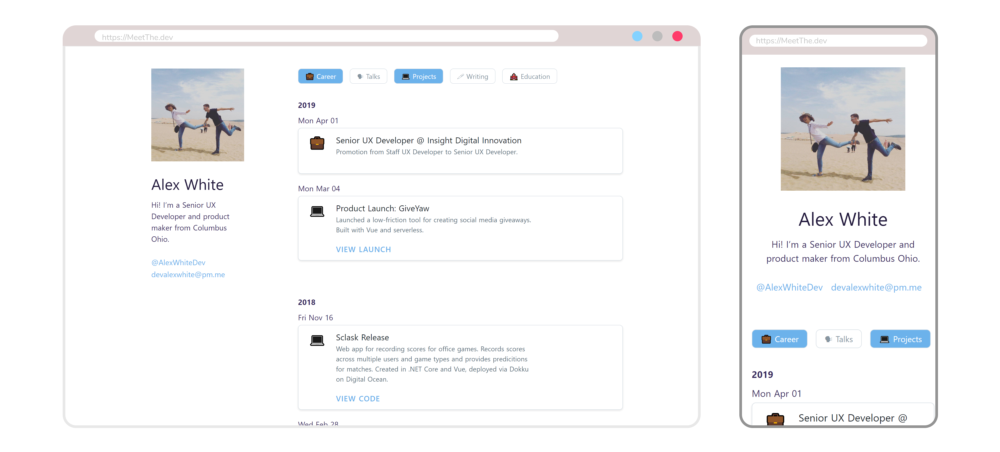

# MeetTheDev: A Timeline Based Portfolio Website ([Example](https://meetthe.dev))

MeetTheDev is a personal portfolio template that lays out your projects, work history, presentations, education history and more in a filterable timeline.

## Features
*  Orders events by year and in descending order
*  Displays filters based on `category` attribute
*  Responsive
*  Perfect for deployment to static site hosts (Netlify, Now) via `yarn run generate`

## Getting Started

1.  Replace `profile.png` in the `static` folder with your own picture.
2.  Add entries to `assets/json/events.json` using the following format:
``` json
[{
    "date": "24 Apr 2019", # Required, "d M YYYY" format
    "icon": "🚀", # Required, emoji symbol
    "title": "Launched MeetTheDev" # Required
    "description": "Personal portfolio template", # Required
    "category": "🚀 Launches", # Required, should use same emoji as icon
    "action": { # Optional
        "title": "View on GitLab",
        "link": "https://gitlab.com/devalexwhite/meetthedev"
    }
}]
```

## Build Setup

``` bash
# install dependencies
$ yarn install

# serve with hot reload at localhost:3000
$ yarn run dev

# build for production and launch server
$ yarn run build
$ yarn start

# generate static project
$ yarn run generate
```

For detailed explanation on how things work, checkout [Nuxt.js docs](https://nuxtjs.org).
